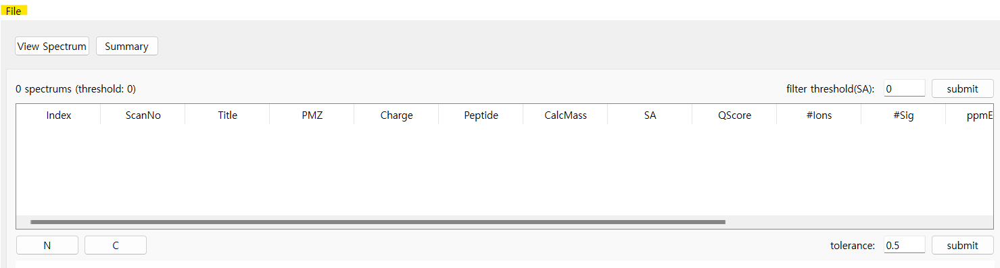
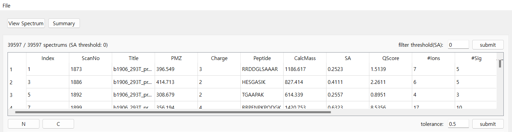
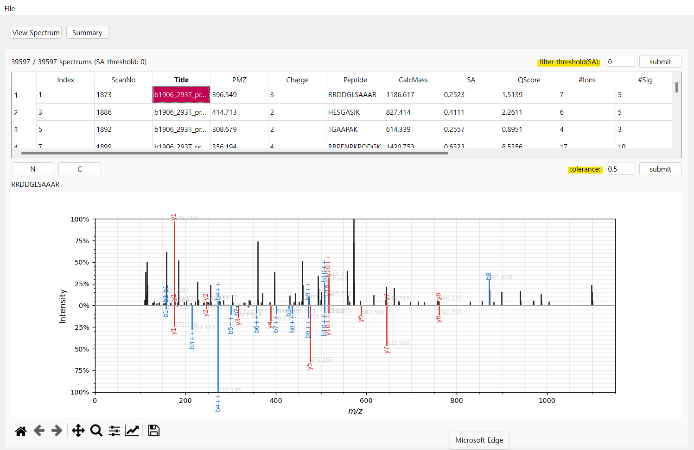
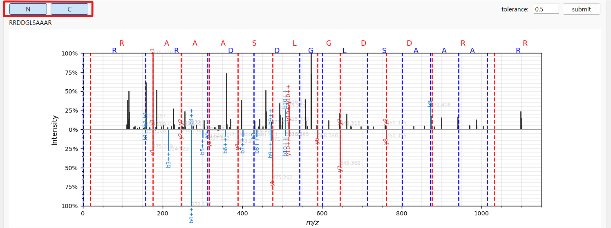
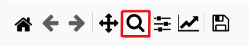
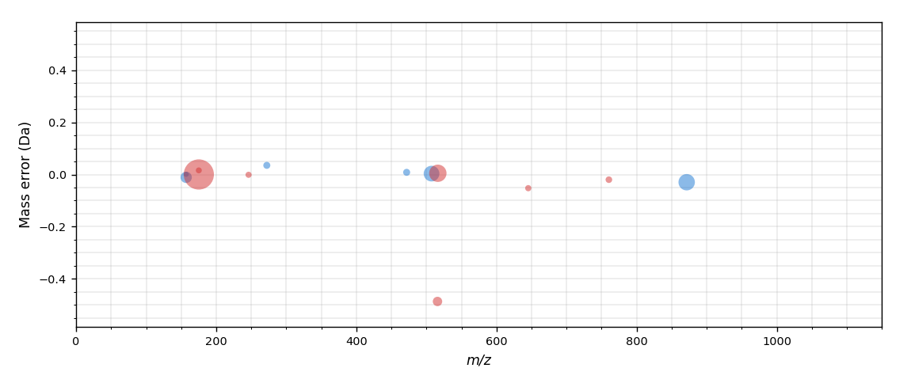
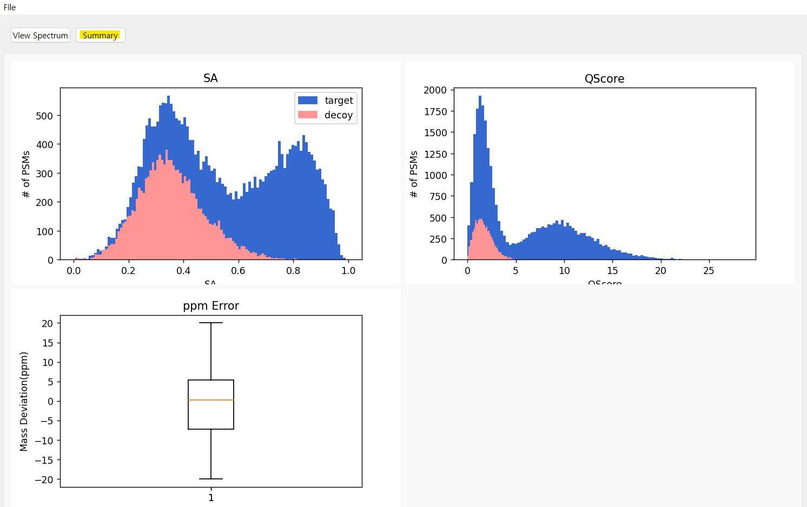

# Spectrum Library Search Program

## 1. Program Introduction

The program matches the peaks observed in the spectrum by contrasting them with the spectrum library and predicts the corresponding peaks. It visualizes the spectrum graph to allow users to easily see the matches.

  
**(Main features)**
* Visualizing the spectrum data filtered by the user-defined SA Score in the Query Spectrum.
* Matching the user-selected spectrum graph against the library within a tolerance range and visualizing the matching spectra using a mirror plot.
* Visualizing amino acid sequences and mass errors in the graph.
* Providing summary information based on the score of the corresponding spectrum.
* Decoy Spectrum ~ 추가로 수정   

## 2. How to use the program
* Open the user's observed spectrum stored in an mgf file from the **File** menu located in the top left corner.
  
    
  
  *  mgf 파일의 형식은 이렇게 이루어져야 합니다. -> 나중에 사진 첨부 추가 수정
  *  When you open the file, the queries will appear in the table on the toolbar.

    

*  Users can select one of the desired spectra and view the spectrum graph in the 'View Spectrum' tab.

    
   
   * Users can set the **mass threshold** of the spectrum library directly using the **tolerance** field located at the bottom of the table. The default value is 0.5.
   * The top section shows the graph of the selected spectrum by the user, while the bottom section represents the results obtained from searching the spectrum library.
   * Using the **filtering** feature, users can view only the spectra within a specific Score range that they have specified.
 * The two buttons at the top of the graph display **N-terminal** and **C-terminal** information on the graph.

    
 * Through the **menubar** at the bottom of the graph, users can zoom in on specific regions of interest in the graph for a closer look.
  
    
 * When you press the **'Mass Error'** button, you can view a graph representing the mass error of the observed spectrum graphs.
  
    

 * In the **'Summary'** tab at the top, you can view a graph summarizing the QScore, SA Score, and ppm error of the corresponding spectrum.
  
    
 * Decoy 스펙트럼을 통해 추후 내용 추가할 예정    
 
## 3. Developer Introduction
제작자 소개글 ~~  
한양대학교 컴퓨터소프트웨어학부 2020089761 강정윤  
한양대학교 컴퓨터소프트웨어학부 2020005269 김세정  
2023